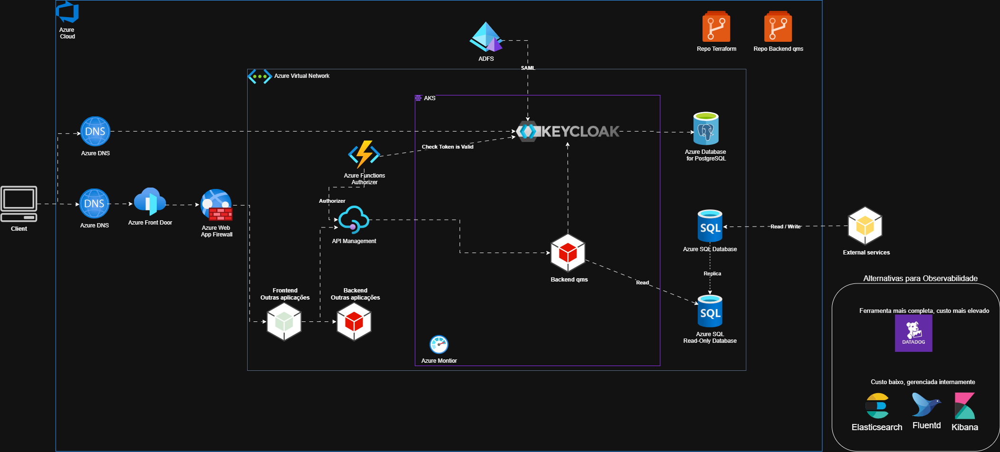
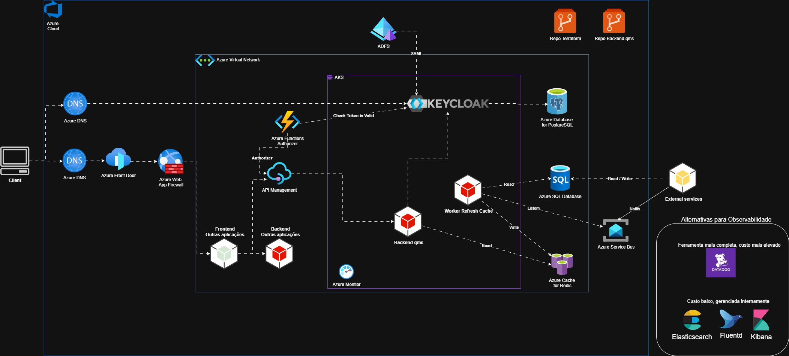

# Sistema CROSS API - .NET 8.0

## Visão Geral
Sistema completo de API para gestão de operações logísticas e comerciais, desenvolvido em C# .NET 8.0 seguindo Clean Architecture.

## Documentações levva
- **Documentação Técnica**: [/docs/Documentacao_Tecnica_POC_QMS_Craft_Levva.pdf](/docs/Documentacao_Tecnica_POC_QMS_Craft_Levva.pdf)
- **Documentação de negócio**: [/docs/Documentacao_Negocio_POC_QMS_Craft_Levva.pdf](/docs/Documentacao_Negocio_POC_QMS_Craft_Levva.pdf)

## Estrutura do Projeto

```
CROSS.API/
├── src/
│   ├── CROSS.API/              # Camada de Apresentação (Controllers, Middlewares)
│   ├── CROSS.Application/      # Camada de Aplicação (DTOs, Interfaces)
│   ├── CROSS.Domain/          # Camada de Domínio (Entidades, Regras de Negócio)
│   ├── CROSS.Infrastructure/  # Camada de Infraestrutura (DbContext, Serviços)
│   └── CROSS.Shared/          # Componentes Compartilhados
├── tests/
│   ├── CROSS.UnitTests/       # Testes Unitários
│   ├── CROSS.IntegrationTests/# Testes de Integração
│   └── CROSS.API.Tests/       # Testes da API
└── CROSS.sln                  # Solution File
```

## Funcionalidades Implementadas

### ✅ Entidades de Domínio
- **UserSession**: Gestão de sessões de usuário
- **Tax**: Taxas logísticas com classes (Origem, Frete, Destino)
- **City**: Cidades com informações de país e aeroporto
- **Country**: Países
- **Tariff**: Tarifários por modal de transporte
- **AirTariff**: Tarifários específicos para modal aéreo
- **Client**: Clientes com tipos específicos
- **Airport**: Aeroportos com códigos IATA
- **ProposalTax**: Taxas associadas a propostas

### ✅ Serviços de Negócio
- **SessionValidationService**: Validação robusta de sessões
- **TaxService**: 9 métodos para gestão de taxas
- **CityService**: 7 métodos para gestão de cidades

### ✅ Infraestrutura
- **CrossDbContext**: Entity Framework configurado
- **ValidateSessionAttribute**: Validação automática de sessão
- **DTOs**: Objetos de transferência de dados estruturados

## Tecnologias Utilizadas

- **.NET 8.0**: Framework principal
- **Entity Framework Core 8.0**: ORM para SQL Server
- **MediatR**: Padrão CQRS
- **AutoMapper**: Mapeamento de objetos
- **FluentValidation**: Validação de dados
- **Serilog**: Logging estruturado
- **Swagger/OpenAPI**: Documentação da API
- **JWT Bearer**: Autenticação
- **Polly**: Políticas de resiliência
- **xUnit**: Framework de testes

- **Mais informações**: [/docs/INFORMACOES_ADICIONAIS_TECNICAS-cross-api.md](/docs/INFORMACOES_ADICIONAIS_TECNICAS-cross-api.md)

## Como Executar

### Pré-requisitos
- .NET 8.0 SDK
- SQL Server (LocalDB ou instância completa)
- Visual Studio 2022 ou VS Code

### Passos
1. **Clone/Extraia o projeto**
2. **Restaurar pacotes**:
   ```bash
   dotnet restore
   ```
3. **Configurar string de conexão** em `appsettings.json`
4. **Executar migrations** (quando implementadas):
   ```bash
   dotnet ef database update
   ```
5. **Executar a aplicação**:
   ```bash
   dotnet run --project src/CROSS.API
   ```

## Endpoints Planejados

### AuthController (4 endpoints)
- `POST /api/auth/login` - Inicia uma sessão
- `POST /api/auth/logout` - Finaliza uma sessão
- `GET /api/auth/validate-session` - Retorna dados de uma sessão
- `POST /api/auth/renew-session` - Renova a validade de uma sessão


### TaxController (9 endpoints)
- `GET /api/tax/selected-classes/{taxId}` - Classes de taxa selecionadas
- `GET /api/tax/all-classes` - Todas as classes de taxa
- `GET /api/tax/list` - Lista de taxas para combo
- `GET /api/tax/all-with-classes` - Taxas com classes
- `GET /api/tax/search-by-class` - Busca por classe
- `GET /api/tax/search-by-name/{initial}` - Busca por nome
- `GET /api/tax/search-by-class-filter` - Filtro por classe
- `GET /api/tax/proposal/{proposalId}` - Taxas de proposta
- `GET /api/tax/search-combined` - Busca combinada

### CityController (7 endpoints)
- `GET /api/city/country-code/{cityId}` - Código do país
- `GET /api/city/search-trade` - Busca para comércio
- `GET /api/city/search-via` - Busca pontos via
- `GET /api/city/description/{cityCode}` - Descrição da cidade
- `GET /api/city/proposal-via-points` - Pontos via para proposta
- `GET /api/city/proposal-origins` - Cidades origem para proposta
- `GET /api/city/proposal-destinations` - Cidades destino para proposta

- **Mais informações**: [/docs/INFORMACOES_DETALHADAS_SOLUCAO-cross-api.md](/docs/INFORMACOES_DETALHADAS_SOLUCAO-cross-api.md)


## Validação de Sessão

Todos os endpoints utilizam o atributo `[ValidateSession]` que:
- Valida automaticamente tokens de sessão
- Atualiza último acesso
- Retorna 401 para sessões inválidas
- Suporte a retorno de lista vazia (configurável)

- **Mais informações**: [/docs/GUIA-AUTENTICACAO.md](/docs/GUIA-AUTENTICACAO.md)

## Banco de Dados

Estrutura otimizada para SQL Server com:
- Índices estratégicos para performance
- Relacionamentos bem definidos
- Constraints de integridade
- Nomes de tabela compatíveis com sistema legado

- Scripts iniciais de banco a serem executados em ordem serão encontrados em [/scripts](/scripts)

## Arquitetura

O projeto segue **Clean Architecture** com separação clara de responsabilidades:

- **Domain**: Regras de negócio puras, sem dependências externas
- **Application**: Casos de uso, DTOs e interfaces
- **Infrastructure**: Implementações concretas, acesso a dados
- **API**: Controllers, middlewares, configurações

## Novas arquiteturas propostas

Arquiteturas levando em consideração serviços de cloud Azure e estratégias de amortização de consumo:

**Versão 1.0:** Uso de DB de leitura (Read-Only DB) para consultas frequentes, reduzindo carga no banco principal.
[](/docs/Proposta_QMS_CROSS_CRAFT-QMS_1.0.drawio.png)

**Versão 1.1:** Uso eventos e cache distribuído para melhorar performance e escalabilidade.
[](/docs/Proposta_QMS_CROSS_CRAFT-QMS_1.1.drawio.png)


## Contato

Sistema desenvolvido seguindo as especificações fornecidas para gestão completa de operações logísticas e comerciais.

